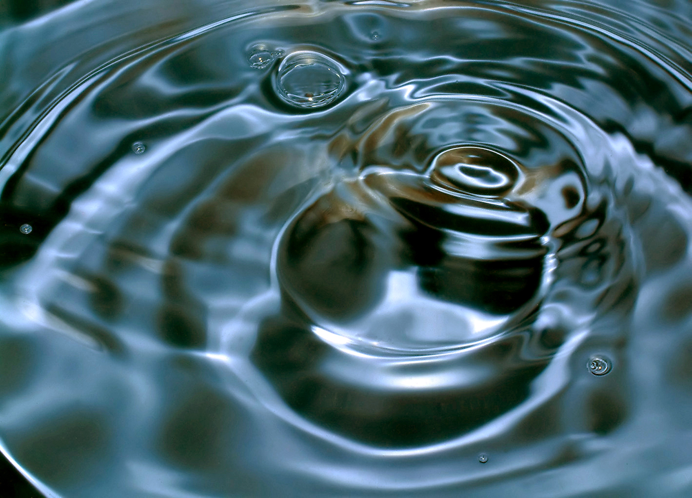

# Colors 1 Reading:

This section had a bunch of definitions that we had touched on in class. But we didn’t cover complex colors very much. I didn’t really know that metalics and such things were classified as colors so I thought this section was interesting. I thought it was cool how we can hear that we are drawn to the changing color of complex colors probably because that is how the water looks. So, it would have been beneficial in order to notice water sources. 

Photo by crazyhorse on Freeimages.com
