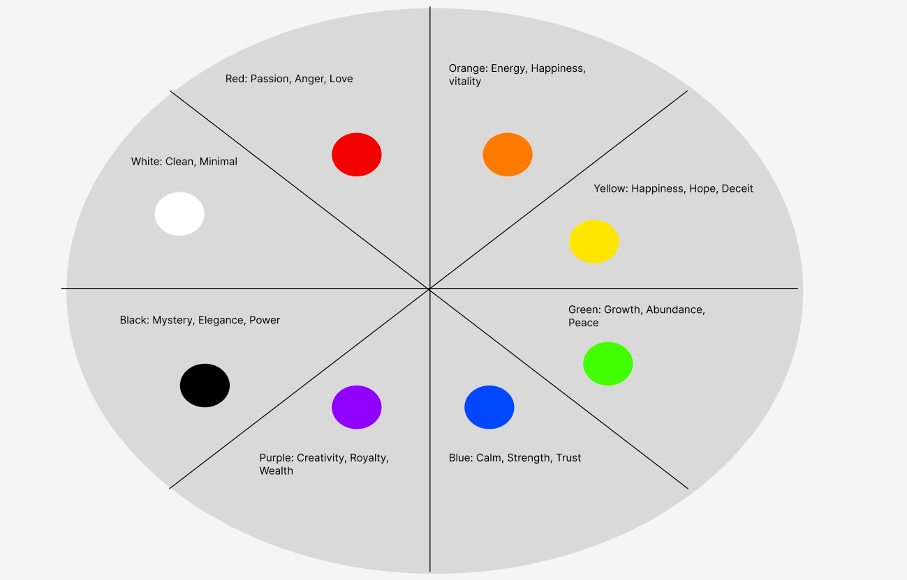

# Colors 2 Reading:

In the reading it goes over the psychology of colors, and how each of the different main colors makes up feel, and what it is used to represent. I’ve made a diagram of some of the words I thought up for the colors.

