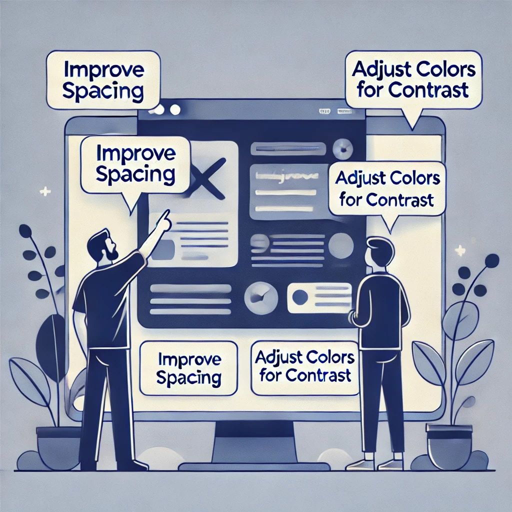

# Feedback Workshop Reading:

"Clarity"

I have used the word "clarity" because the article has focused on the fact that feedback must be clear and specific to the designers. Feedback on design and not on the designer, and also be constructive, so that it facilitates growth, without confusion or defensiveness.

Receiving clear, constructive feedback will be very important in my future career because this enables effective collaboration and allows team members to improve their work without negatively affecting morale.

generated by chatGPT 4o