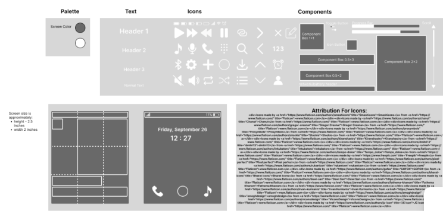

# Design Evolution Narrative

By Isaac Kenney

## Table of Contents

- [Introduction](#introduction)
- [Project Inspiration and Motivation](#project-inspiration-and-motivation)
- [How the UI Improves Lives](#how-the-ui-improves-lives)
- [Target Device Type](#target-device-type)
- [Story Inspiration](#story-inspiration)
- [Early Sketches](#early-sketches)
- [Design System Creation](#design-system-creation)
- [Mockups](#mockups)
- [Prototype Before User Tests](#prototype-before-user-tests)
- [Colleague Assessment](#colleague-assessment)
- [User Testing Procedures](#user-testing-procedures)
- [Consistency with Core Values](#consistency-with-core-values)
- [Conclusion](#conclusion)

## Introduction

My name is Isaac Kenney. I decided to work alone on the final project for Honors User Interfaces. I am a senior studying Software Engineering at the University of Nebraska Lincoln. My interest in user interfaces lies in my role as an intern for a Lincoln startup called Boveye. Our company does work with AI, and both my bosses have experience in business and AI. My role is covering all other software-related gaps in the company. This has led me to learn bits and pieces from many different areas of the field of software. I chose this class to further my understanding of UI/UX design so I can help my team in the future. I chose a final project that is close to home for me and simplifies my variables so I can focus on the basics in what we learned this year.

## Project Inspiration and Motivation

Instead of choosing a new UI to create, I chose an existing one to improve upon. The UI I chose is the UI for my phone, **The Light Phone II**. It’s a minimalist phone that keeps to the main functionality of a phone with a couple added “smartphone” features. This makes the number of possible pages pretty reasonable to accomplish for a project. There are also some hardware limitations. The phone’s screen is 2x2.5 inches and it is an E-Ink screen. An E-Ink screen is often seen in small reading tablets like a Nook. It can’t be scrolled easily, its refresh rate is very slow, and it can only be viewed in grayscale. I’ve used the phone for over a year now and I like it. The goal of the phone is to be used as little as possible, and it accomplishes that goal very well. That being said, the hardware limitations were not taken into great enough consideration when designing the phone. There are too many functions that rely on a very poor scrolling system, there are some very nested pages that can be cumbersome to get to with the refresh rate, and pages get cluttered with a lack of use of spacing and containing. My project looks to address those issues and other bits I found along the way. I feel that I am in a position to redesign the UI given my frequent use of it over the past year and my experience with user interfaces in my degree.

## How the UI Improves Lives

This user interface looks to further the goals set by The Light Phone and their company: to create a minimal smartphone experience that doesn’t take you away from your real life. My project will do this by addressing issues with the UI that are limited due to the hardware, and it will set the user experience closer to the users' goals for the phone. This will improve the lives of the users by giving them a smoother experience of the phone that enables them to get in and out with the functionality they need from the phone.

## Target Device Type

The device this UI is meant for is **The Light Phone II**. Its features are listed below:

- The phone is 3.8” x 2.2”, and the screen is 2.5” x 2.0”.
- The screen is an E-Ink screen.
- It is in grayscale.
- When the screen needs to change, the whole screen needs to refresh.
- Refreshing takes a long time (0.2-0.65s).
- The screen cannot detect scrolling naturally.
- Animations cannot be accomplished.

## Story Inspiration

To start the design process, I wrote a user story to inspire and facilitate the needs of my user interface. The story follows **Jack Bloomington** as he gets ready to bike to work. He wants to get his music on, so he uses the UI to get to the music page and start his favorite album. He also connects his earbuds to the phone. This story encapsulates a lot of what I want to accomplish. Jack wants to reach his favorite album and connect his earbuds quickly, so that he can start biking, and once he is biking he can’t afford to look at his phone again. This story facilitates the need for quick navigation and simple user interactions.

## Early Sketches

When I started sketching the first drafts of some of the main pages, I tried to improve the navigation and intuitive design.

*This first page is the lockscreen. The only add-ons here were the two icons to the left and right of the home button. These were for the message board and media page. This was an attempt to decrease the user interactions needed to reach what are the two most used pages in the phone.*

*This page was the media page. It was supposed to have a recent summary of music and podcasts to pick from, with options to reach the actual music page and podcast page. I decided, soon after creating this, that it wasn’t necessary and probably just cluttered the navigation more, so it was removed and the media icon button on the main page now points to the music page. Another piece that was later added to a similar-looking page was the scroll bar. Since scrolling is difficult, you simply click the part in the bar you want to reach. If the scroll is too precise, two arrows above and below are added to help with specific navigation. This the user attempts to scroll with little success.*

## Design System Creation

After making sketches and mulling over designs in my head, I created my initial design system. It was a pretty simple one, considering my project material. I chose only four font sizes and one font. For the color palette, I decided that even though I had a whole scale of grey, since the phone really only used one color of grey, that so would I. The most unique part of the design system was the number of icons. A phone needs lots of icons, but I also wanted to replace a lot of the text buttons used on the old phone UI with icons for a simpler and more universal understanding. The only complex components in the design system were the toggle button and scroll bar. As you can see, there is also an example screen with a 3x3 overlay to help design the mockups.

## Mockups

This was my first set of mockups for the pages in the UI. I ended up covering most of the main pages and most of the functionality. When I started making these mockups, I started to adjust some of my strategies. I started using more white outlined containers for lots of the components. I thought this would help section things out and make it clear when things were interactable. I also started veering away from the 3x3 structuring that I wanted to use. This was by accident; I ended up getting into a flow designing and hadn’t put a proper outline in place to keep my designs in line.

## Prototype Before User Tests

This was the initial prototype created in Figma from the mockups.

<iframe
  style={{ border: '1px solid rgba(0, 0, 0, 0.1)' }}
  width="800"
  height="450"
  src="https://embed.figma.com/design/EMTHMAiKikJiirIRPrKgJX/HUI-Design-System-with-Prototype?node-id=2002-29&embed-host=share"
  allowFullScreen
></iframe>

Here is a walkthrough of how to use it.

**Start:**

- You are on the lockscreen.
- You can click on the circle in the middle to reach the main dashboard.
- You can click on the left or right icon buttons to reach the message board or music page.

**You are on the dashboard:**

- From here you can reach any of the main pages including:
  - Message Board
  - Alarm Page
  - Contact
  - Calendar
  - Notes
  - Music
  - Podcasts
  - Settings

At this point, the backward navigation is very bad; use the back arrow provided by Figma to go back a page when able.

## Colleague Assessment

Now that we had a working and testable prototype, we started our rounds of testing. We started with some simple in-class testing with our colleagues. The format was pretty simple: we would walk them through a testing script with a single task related to our prototype. Along the way, we would ask them questions about the prototype and get their reactions to their first impressions of the prototype and their interactions with it.

My colleagues that I tested the prototype on came back with a lot of helpful feedback. The biggest one being the backward navigation. I had added it in several places but in general, the backward navigation was lacking on many pages and sometimes the navigation would take you to an unwanted screen, not the previous one. Another navigation-related one was that one of the main navigation pieces from the phone, the side button on the outside of the phone, was not added anywhere, which took away from the users' ability to navigate easily. Since this was a hardware piece, it was going to be difficult to add to the prototype. Finally, some of the icons were confusing to the users or in confusing places.

My prototype’s strengths were its simplicity and its easy-on-the-eyes look. For weaknesses, the icons were not the best researched and were a little confusing, and the prototype was not easy to use due to the lack of backward navigation in its function.

After the experience, I ended up revamping all the backward navigation. I took another look at the icons and updated any that I found to be confusing for my colleagues and others that I thought might get in users' way. Finally, there were some small changes: I added an enter button on the keyboard and added some pages to the settings area.

## User Testing Procedures

After making changes based on colleague testing, I moved on to user testing. For my testing, I gathered my users. I chose to test two users: one was an experienced Light Phone user, and the other had no experience with the device before. I did testing in person. To begin testing, I would provide the user with the prototype on my computer and I would use a printed-out testing script to walk them through some aspects of the device and of the test. Then I would walk them through several pre-designed tasks to facilitate their experience. As they did the tasks, they would vocalize their thoughts and thought processes to help me note what they were thinking. After the test was done, I debriefed on the experience and put together my results.

For detail, some of the tasks I used were:

### Make a Phone Call

- The user will start on the lock screen.
- **Script:** “Starting on the lock screen, you need to make a phone call to your mother, named ‘mom’ in your contacts. Use the interface to navigate and call ‘mom’.”

### Send a Text Message

- The user will start on the lock screen.
- **Script:** “Starting on the lock screen, you need to send a text message to your father, named ‘dad’ in your contacts. The contents of the message are “Hi, Dad”. Use the interface to navigate the message board and send the text.”

### Shuffle Play the “Best Album”

- The user will start on the dashboard.
- **Script:** “Pretend you are about to walk to class and you want to shuffle play your favorite album whose name is “Best Album”. Navigate the user interface in front of the dashboard to shuffle play the album.”

After this experience, I committed to change five things based on the feedback.

1. Need to add contact info page for when user clicks on contact from contact list.
2. Podcast list page not implemented from button click on podcast page.
3. No Bluetooth connect page added into Bluetooth buttons.
4. On the music page, it is unclear what to do with the listed albums under the main album.
5. Need to add a button to delete notes on the Notes Page.

These changes were necessary to usability. It completed missing functionality on key features on the user interface. This can be seen in changes 1, 2, 3, and 5. And it addressed a confusing page ordering in the music page that made it difficult to understand, as seen in change 4. In general, this improved usability because now the user can access more functionality in the user interface and is less confused with the organization of the music page in the prototype.

Here is the final Prototype of The Light Phone User Interface.

<iframe
  style={{ border: '1px solid rgba(0, 0, 0, 0.1)' }}
  width="800"
  height="450"
  src="https://embed.figma.com/design/dXNtfa7gxgSFLL7L6o2CQ7/HUI-Design-System-with-Prototype-Fixes-1?node-id=0-1&embed-host=share"
  allowFullScreen
></iframe>

## Consistency with Core Values

At the beginning of the project, I identified two values that I thought were critical to address in this project: minimalism and intuitiveness. After completing the project, I believe I have achieved this in my design. The app has a minimal look and feel, but also is minimal in its page nesting and page design. These minimal aspects can specifically be seen in the lack of items on each page and the use of grayscale and spacing to keep it simple. It is also intuitive in its page structuring and in the icons that are used, which are generally universally understood in the age of smartphones.

## Conclusion

Finally, the user interface is complete. At the beginning, I set out to improve upon the existing Light Phone II user interface. Because of its hardware limitations, it had many usability issues. I also set out to maintain the user interface's core values with the redesign—these core values being minimalism and intuitiveness. I went through many phases to create my final design, starting with user interviews and sketches, to prototyping, and finally to a series of in-depth testing. After all that, the result is a design that I am proud of. I believe that it addresses the usability issues of the previous version with better scroll bars that don’t require scrolling, more intuitive and simple page nesting, and a focus on icons instead of the cluttering text buttons used previously. This project has also helped me further my investment in my career. I’ve learned how to apply different topics we learned in class into my design process, like a design system to help contain and quicken design. I’ve also become more competent in UI/UX design with numerous topics under my belt now, like color congruency, addressing system values, and accessibility features. All these things will help in my future and in the shorter-term future as a full-stack developer for the company I work for.